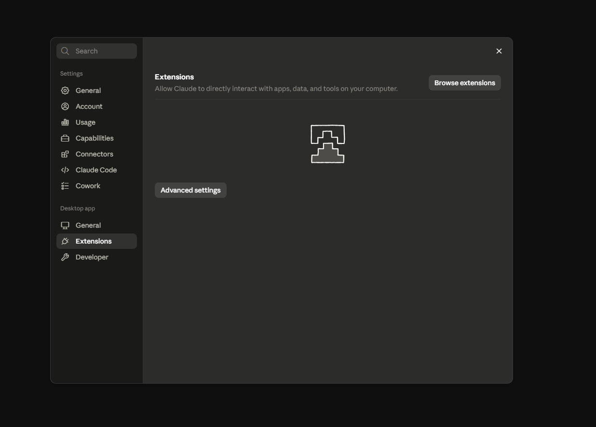
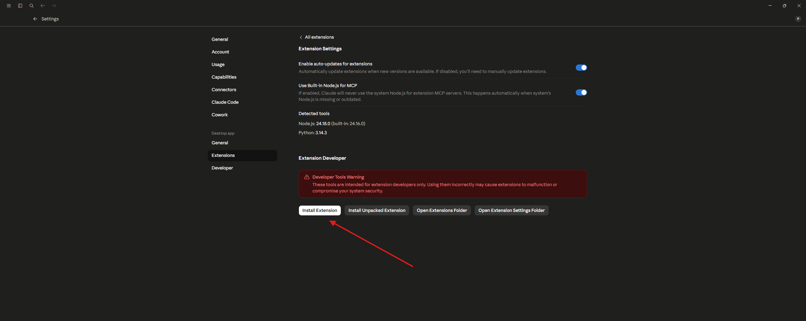
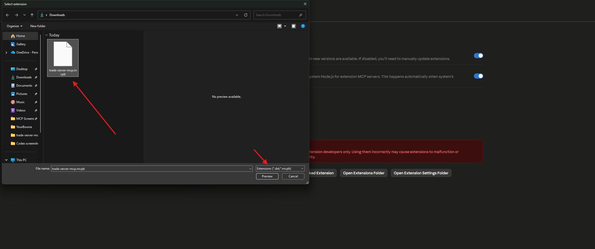
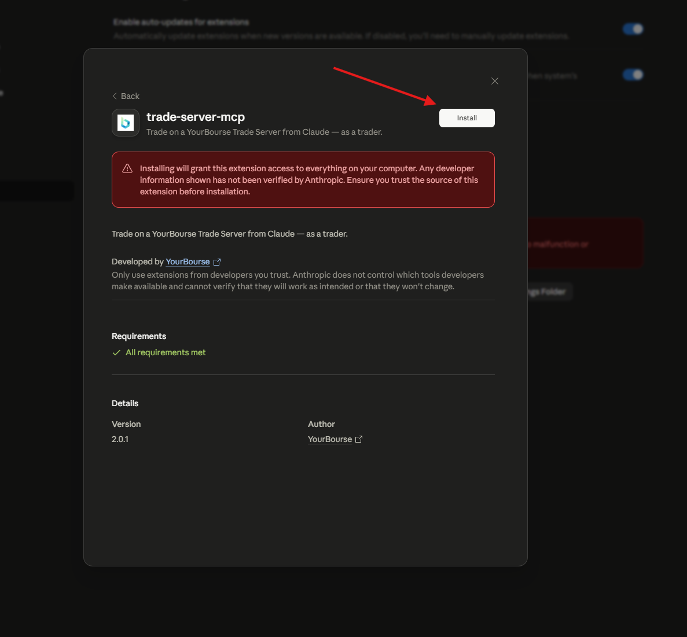
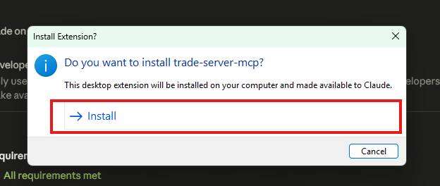
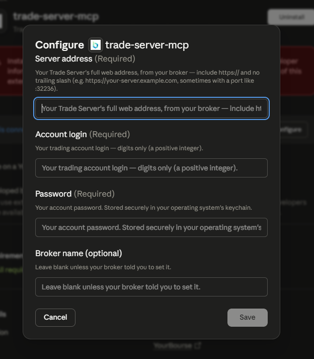
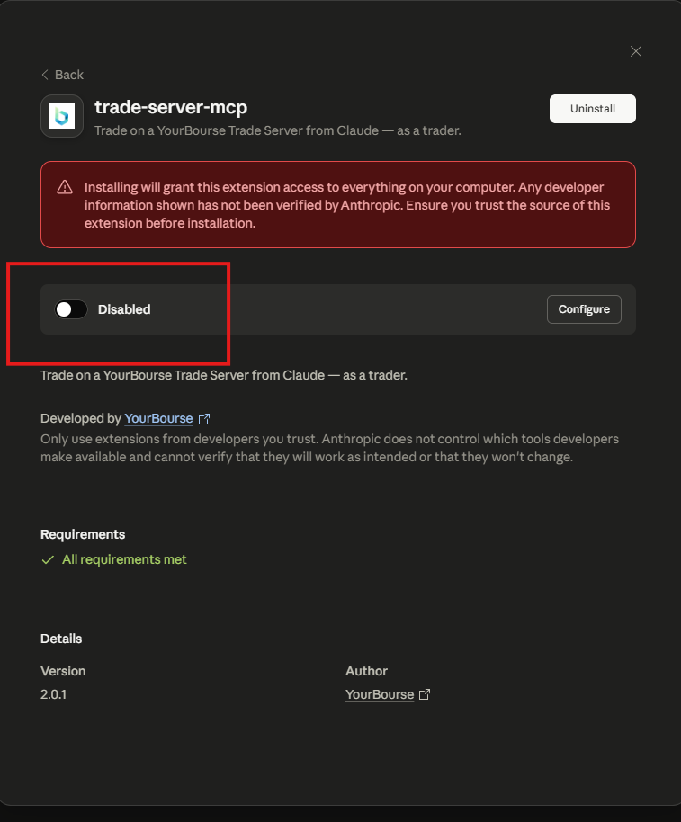
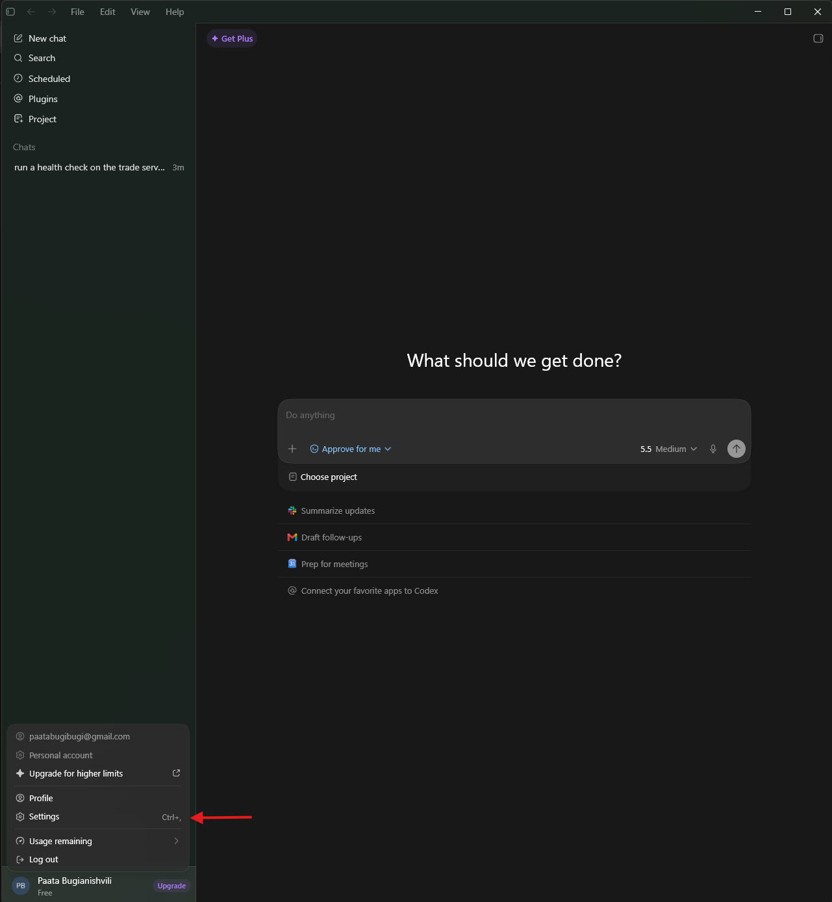
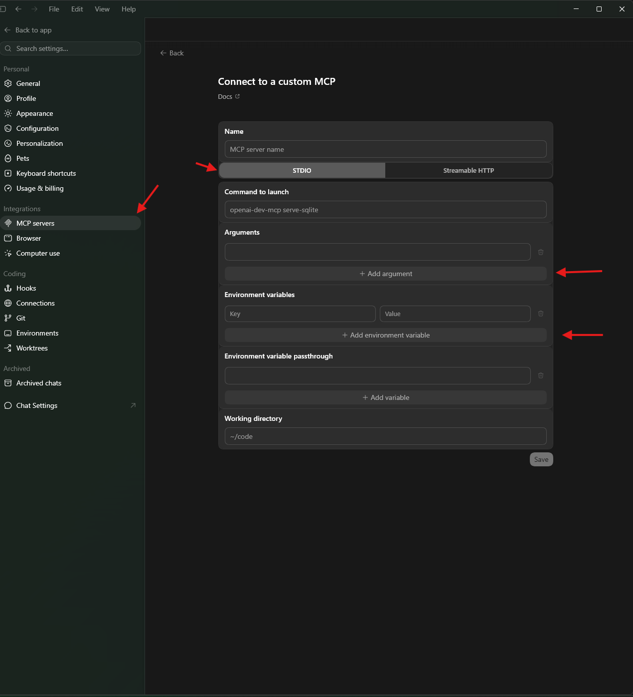
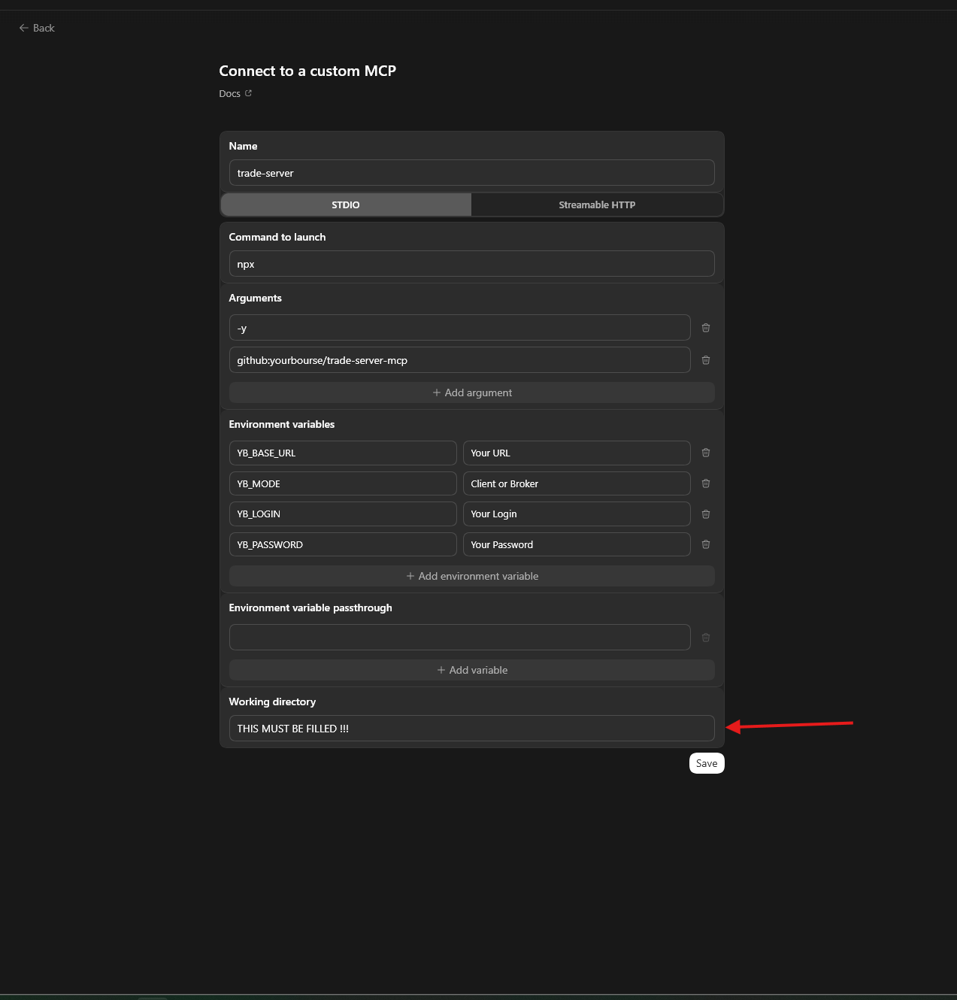

<div align="center">

# Trade Server MCP

**Trade on a YourBourse account from Claude and other AI assistants — just by asking.**

[](https://github.com/yourbourse/trade-server-mcp/actions/workflows/ci.yml)
[](https://github.com/yourbourse/trade-server-mcp/blob/main/CHANGELOG.md)
[](https://modelcontextprotocol.io/)

[](LICENSE)

<br>

A [Model Context Protocol](https://modelcontextprotocol.io/) server that connects your AI assistant
to a YourBourse Trade Server. Ask it to check your account, pull live quotes, and place or manage
orders — no scripts, no copy-pasting API responses. Brokers get a server-wide **admin mode** too.

</div>

---

## ▶ Get started

You'll be talking to your trading account through your AI assistant in about **10 minutes, with no coding**.
**Pick how you want to install** — each option below expands to a complete, screenshot-by-screenshot walkthrough.

> **Everything below is free and installs in a few clicks.** Each method lists exactly what it needs — the one-click `.mcpb` is the lightest (just [Claude Desktop](https://claude.ai/download)); the manual path adds [Node.js](https://nodejs.org) + [git](https://git-scm.com); Codex uses its own app plus [Node.js](https://nodejs.org) (for `npx`).

<details>
<summary><b>📦 Claude Desktop — one-click <code>.mcpb</code> extension (easiest) · screenshot walkthrough</b></summary>

<br>

For traders **and** managers/brokers — no Node, git, or config file needed. One form (login + password); the extension detects your role automatically when it signs in. **Managers: use your admin API address.**

**Download** `trade-server-mcp.mcpb` from the [latest release](https://github.com/yourbourse/trade-server-mcp/releases/latest) (under **Assets**), then in Claude Desktop:

1. **Settings → Extensions** (under **Desktop app**) → **Advanced settings**

   

2. **Extension Developer → Install Extension**

   

3. Select the downloaded **`trade-server-mcp.mcpb`**

   

4. Review (**Version 2.2.0** or later — manager support and auto-detection need 2.2.0+ — and "All requirements met") → **Install**

   

5. Confirm the **"Install Extension?"** prompt → **Install**

   

6. Fill the **Configure** form (server address, login, password, optional broker) → **Save**

   

7. Flip the toggle to **enable** it (it starts **Disabled**)

   

Then ask Claude _"run a health check"_ to confirm. Full guide: **[Claude Desktop Setup](docs/CLAUDE_DESKTOP_SETUP.md#one-click-install-claude-desktop-extension)**.

</details>

<details>
<summary><b>🖥️ Claude Desktop — manual setup (npx + config file) · screenshot walkthrough</b></summary>

<br>

Needs **Node.js**, **git**, and **Claude Desktop** installed.

1. Install **Node.js** (LTS) from [nodejs.org](https://nodejs.org), run the installer, then confirm the version in a terminal.

   
   
   

2. Install **git** from [git-scm.com](https://git-scm.com), then confirm it.

   
   

3. Install **Claude Desktop** from [claude.ai/download](https://claude.ai/download).

   

4. In Claude Desktop, open **Settings → Developer → Edit Config**.

   

5. Paste this in, filling the **three details from your broker** (your normal trading account login):

   ```json
   {
     "mcpServers": {
       "trade-server": {
         "command": "npx",
         "args": ["-y", "github:yourbourse/trade-server-mcp"],
         "env": {
           "YB_BASE_URL": "<your-server-url>",
           "YB_MODE": "client",
           "YB_LOGIN": "<your-login>",
           "YB_PASSWORD": "<your-password>"
         }
       }
     }
   }
   ```

   
   

6. **Fully quit and reopen** Claude Desktop.

   

7. Confirm the trade-server tools appear.

   

8. Ask Claude _"run a health check"_ — a healthy status means you're connected.

   

Full guide: **[Claude Desktop Setup](docs/CLAUDE_DESKTOP_SETUP.md)**.

</details>

<details>
<summary><b>🤖 OpenAI Codex · screenshot walkthrough</b></summary>

<br>

Codex runs the MCP locally via `npx`. In Codex, open **Settings → MCP servers** and add a custom (STDIO) server.

1. Open Codex **Settings**.

   

2. Go to **MCP servers** and add a new server.

   

3. Fill it in — name `trade-server`, command `npx` with args `-y github:yourbourse/trade-server-mcp`, and the four `YB_` environment variables (`YB_BASE_URL`, `YB_MODE=client`, `YB_LOGIN`, `YB_PASSWORD`) — plus the optional `YB_BROKER` if your broker requires it. **Save and fully restart Codex.**

   

Full guide: **[Codex setup](docs/CODEX_SETUP.md)**.

</details>

**Once connected** (any method), ask your assistant _"Run a health check on the trade server."_ If it reports the server's time and version, you're set — ask for quotes, your balance, or to place a trade.

#### Other apps

| App | Guide |
|---|---|
| **VS Code (GitHub Copilot)** | [VS Code setup](docs/VSCODE_SETUP.md) |
| **Claude Code (CLI)** | one command — see [Configuration](docs/CONFIGURATION.md#configuration-examples) |

> **Broker administrator?** Sign in with your manager login + password (your role is detected
> automatically), or use `YB_MODE=admin` with an API key pair — see
> [Admin Mode](docs/ADMIN_MODE.md). &nbsp;·&nbsp; Issued an API **token pair** instead of a password?
> See [Getting an API token pair](docs/CONFIGURATION.md#getting-an-api-token-pair).

---

## What you can do

| Feature | Description |
|---------|-------------|
| **Two modes, one server** | **Client mode** for traders (scoped to your own account) and **admin mode** for broker operations (server-wide) — detected from your sign-in (or pinned with `YB_MODE`) |
| **30 trader tools / 89 broker tools** | Task-shaped tools covering trading, account monitoring, market data, and (admin) server configuration, plus MCP resources for static context |
| **Live trading** | Market, Limit, Stop, StopLimit, and CloseBy orders with optional SL/TP; modify, cancel, partial close, flatten-everything composites |
| **Account monitoring** | Balance, equity, margin, unrealized P/L, open positions, working orders, trade and transfer history — single calls or one-shot summaries |
| **Market data & indicators** | Quotes, market depth, OHLCV candles, currency conversion; admin mode adds locally computed indicators (RSI, MACD, EMA, Bollinger Bands, and more) |
| **HMAC auth with auto-refresh** | Every write is HMAC-SHA256 signed; client login sessions refresh automatically before expiry — no manual token handling |
| **Safety by design** | Order-placing requests are never retried on connection errors (no duplicate fills); bulk tools report per-item outcomes; client sessions cannot touch other accounts |
| **Confirm before you trade** | Anything that moves money is a two-step **plan → commit** — your AI previews the order and nothing executes until you confirm |

---

## Trader or broker?

One process runs exactly one mode — the tool set is decided at startup from your credentials.

| | Client mode (traders) | Admin mode (brokers) |
|---|---|---|
| **Who it's for** | A trader with an account at a broker running a YourBourse Trade Server | The broker: operations and administration teams |
| **Scope** | Your own account only — the session token *is* the scope, enforced by the server | Server-wide: every account, group, client, routing rule, and liquidity connector |
| **Tools / resources** | 30 tools, 1 resource | 89 tools, 4 resources |
| **Credentials** | `YB_LOGIN` + `YB_PASSWORD` (or a pre-issued token pair) | Manager `YB_LOGIN` + `YB_PASSWORD`, or `YB_API_KEY` + `YB_SECRET_KEY` from the server admin panel |
| **Trading** | On your account; no account parameter exists | On behalf of any account via `accountId` |
| **Extras** | Rate-limit visibility, scoped balances | Cash transfers, order routing management, indicators, L1/L2 over WebSocket |

Full guides: [Client Mode](docs/CLIENT_MODE.md) · [Admin Mode](docs/ADMIN_MODE.md)

---

## Documentation

### Setup & Configuration

| Guide | Description |
|-------|-------------|
| [Getting Started](docs/GETTING_STARTED.md) | From a fresh machine to your first successful tool call, step by step |
| [Claude Desktop Setup](docs/CLAUDE_DESKTOP_SETUP.md) | Click-by-click install for Claude Desktop, with screenshots — no experience needed |
| [VS Code (Copilot) Setup](docs/VSCODE_SETUP.md) | Click-by-click install for VS Code + GitHub Copilot, plus a note on ChatGPT |
| [Codex Setup](docs/CODEX_SETUP.md) | Click-by-click install for the OpenAI Codex app (custom MCP form), with the Windows working-directory gotcha |
| [Configuration](docs/CONFIGURATION.md) | Every environment variable, mode selection rules, ready-to-paste client configs, and [running more than one server](docs/CONFIGURATION.md#running-more-than-one-server) |

### Using the Server

| Guide | Description |
|-------|-------------|
| [Client Mode](docs/CLIENT_MODE.md) | The trader's guide: scoping model, what you can do, and what's deliberately impossible |
| [Admin Mode](docs/ADMIN_MODE.md) | The broker's guide: server-wide operations, configuration tools, and safe usage |
| [Tools Reference](docs/TOOLS_REFERENCE.md) | Every tool in both modes — descriptions, parameter tables, and example calls |
| [Usage Examples](docs/USAGE_EXAMPLES.md) | Realistic conversations: what you say, which tools the AI calls, what comes back |

### Reference & Internals

| Document | Description |
|----------|-------------|
| [Architecture](docs/ARCHITECTURE.md) | Components, module map, mode selection, and the life of a tool call |
| [Authentication](docs/AUTHENTICATION.md) | HMAC-SHA256 signing, the four credential setups, token refresh, and failure handling |
| [Security](docs/SECURITY.md) | Credential-handling guarantees, config-file hygiene, supply-chain stance, reporting |

### Help & Contributing

| Document | Description |
|----------|-------------|
| [Troubleshooting](docs/TROUBLESHOOTING.md) | Symptom-indexed fixes, from startup errors to old-server compatibility |
| [FAQ](docs/FAQ.md) | Quick answers to the questions that come up most |
| [Contributing](docs/CONTRIBUTING.md) | Dev setup, the hand-written-tools policy, how to add a tool, conventions |

---

## Security

Your password is never transmitted — in client login mode it is used only as the local HMAC
signing secret for the sign-in request. Credentials live exclusively in your MCP client's
configuration and the server's process environment; nothing is ever written to disk, logged,
or echoed back to the AI. Order-placing requests are never retried on connection errors, so a
network blip cannot turn into a duplicate fill. The project ships **no npm package by
design**: distribution is npx straight from GitHub — the `main` branch by default, or a pinned tag
or commit for a reproducible build — never the npm registry, keeping the supply chain to four direct
runtime dependencies. Full details, recommended practices, and the vulnerability reporting
process are in [SECURITY.md](docs/SECURITY.md).

---

<details>
<summary><b>For developers</b> — clone &amp; build, architecture, project layout, scripts</summary>

<br>

Most users never need this — the setup guides above are all you need to run the server. This
section is for reading or modifying the source.

### Run from a local clone

```bash
git clone https://github.com/yourbourse/trade-server-mcp.git
cd trade-server-mcp
npm ci
npm run build
```

Then point your MCP client at the build with `"command": "node", "args": ["<path-to-repo>/dist/index.js"]`
and the same `env` block as above. (The no-clone `npx` install in the guides is recommended for
everyone else.)

### Architecture overview

```
+--------------------+      stdio (JSON-RPC / MCP)
|     MCP client     | <-------------+
| (Claude Desktop,   |               |
|  Claude Code, ...) |               v
+--------------------+    +--------------------+
                          |      index.ts      |
                          |  parse env config, |
                          |     pick a mode    |
                          +---------+----------+
                                    |
                    +---------------+---------------+
                    v                               v
         +--------------------+         +---------------------+
         | register-admin.ts  |         | register-client.ts  |
         | 89 tools, 4 res.   |         | 30 tools, 1 res.    |
         +---------+----------+         +----------+----------+
                   |                               |
                   v                               v
         +--------------------+         +---------------------+
         |   tools/admin/*    |         |   tools/client/*    |
         +----+----------+----+         +----------+----------+
              |          |                         |
 quotes/depth |          +-----------+   +---------+
              v                      v   v
         +-----------+      +------------------------------+
         | WsClient  |      |          RestClient          |
         | (admin    |      |  HMAC signing, auth retry,   |
         |  only)    |      |  semantic errors, ETag cache |
         +-----+-----+      +---------------+--------------+
               |                            |
               v                            v
         +---------------------------------------------+
         |          YourBourse Trade Server            |
         |       /api/v1 (REST)     /ws/v1 (WS)        |
         +---------------------------------------------+
```

| Module | Purpose |
|--------|---------|
| `src/index.ts` | Entry point: parse config, build the auth provider and clients for the selected mode, register tools, connect stdio |
| `src/config.ts` | Environment-variable parsing: mode selection and inference, validation, startup error messages |
| `src/register-admin.ts` / `src/register-client.ts` | The single place where tool names and descriptions live, per mode |
| `src/rest-client.ts` | Signed REST client: HMAC headers, semantic error mapping, ETag caching, 401 renew-and-retry, transport retry policy |
| `src/ws-client.ts` | WebSocket client for live quotes and market depth (admin mode only) |
| `src/auth/` | HMAC-SHA256 signing, static key credentials, and the client login lifecycle with auto-refresh |
| `src/tools/admin/`, `src/tools/client/` | Tool implementations — a zod schema plus an async function per tool, grouped by category |

The full picture — mode selection, the life of a tool call, retry policy, and design decisions —
is in [Architecture](docs/ARCHITECTURE.md).

### Project structure

```
trade-server-mcp/
├── src/
│   ├── index.ts               # Entry point: config → mode → register → stdio transport
│   ├── config.ts              # Env parsing, mode selection & inference
│   ├── register-admin.ts      # Registers the 89 admin tools + 4 resources
│   ├── register-client.ts     # Registers the 30 client tools + 1 resource
│   ├── tool-handler.ts        # Wraps tool results/errors for MCP
│   ├── rest-client.ts         # Signed REST client (HMAC, retries, ETag, error mapping)
│   ├── ws-client.ts           # WebSocket quotes/depth client (admin only)
│   ├── auth/
│   │   ├── admin-auth.ts      # HMAC-SHA256 signing + static credentials
│   │   └── client-auth.ts     # Login sign-in, token auto-refresh, failure hints
│   ├── tools/
│   │   ├── admin/             # trading, account, market-data, config tool modules
│   │   └── client/            # trading, account, market-data tool modules
│   └── test/                  # node:test suite
├── docs/                      # Full documentation set (see index above)
├── reference/
│   └── openapi.json           # Trade Server API contract the tools are checked against
├── scripts/
│   └── regression-admin.mjs   # Live stdio regression harness (admin | client)
├── .github/workflows/ci.yml   # CI: lint, format check, type-check, tests
├── eslint.config.js
├── tsconfig.json
├── package.json
├── CHANGELOG.md
└── LICENSE
```

### Scripts

| Command | Description |
|---------|-------------|
| `npm run build` | Compile TypeScript to `dist/` |
| `npm run dev` | Compile in watch mode |
| `npm test` | Build and run the full test suite (`node --test`) |
| `npm run lint` | ESLint over the project |
| `npm run format` / `npm run format:check` | Prettier write / verify |
| `npm run type-check` | TypeScript type checking without emitting |
| `npm start` | Run the built server directly (stdio) |

### Live regression harness

`scripts/regression-admin.mjs` drives the **built** server over raw stdio JSON-RPC against a
real Trade Server — exactly like an MCP client would. Credentials come from the environment;
nothing is hardcoded:

```bash
# Admin mode
YB_API_KEY=... YB_SECRET_KEY=... YB_BASE_URL=... node scripts/regression-admin.mjs admin

# Client mode
YB_MODE=client YB_LOGIN=... YB_PASSWORD=... YB_BASE_URL=... node scripts/regression-admin.mjs client
```

Exit code 0 means all checks passed.

</details>

---

## License

Licensed under the Apache License, Version 2.0. Copyright 2026 YourBourse.

You may use, modify, and distribute this software under the terms of the license.
See [LICENSE](LICENSE) for the full text.
