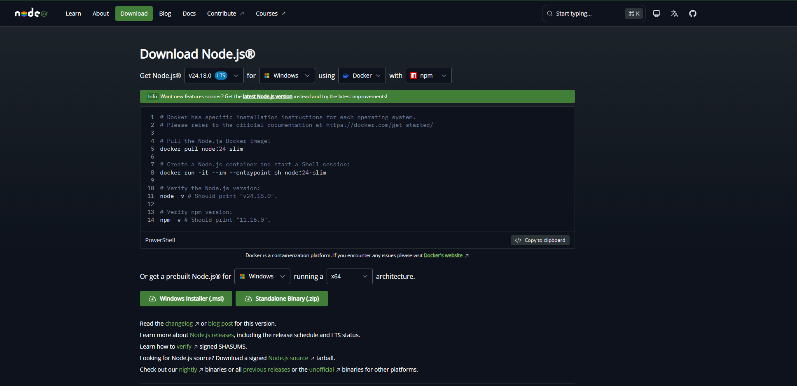
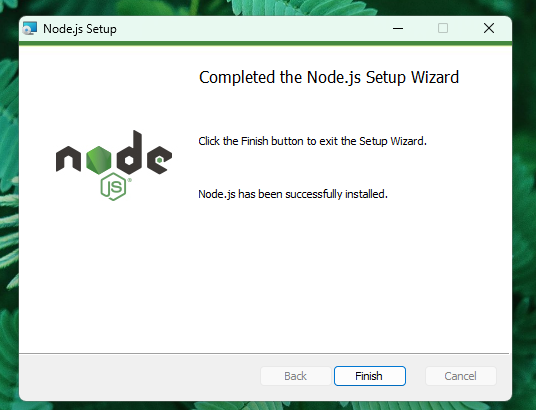
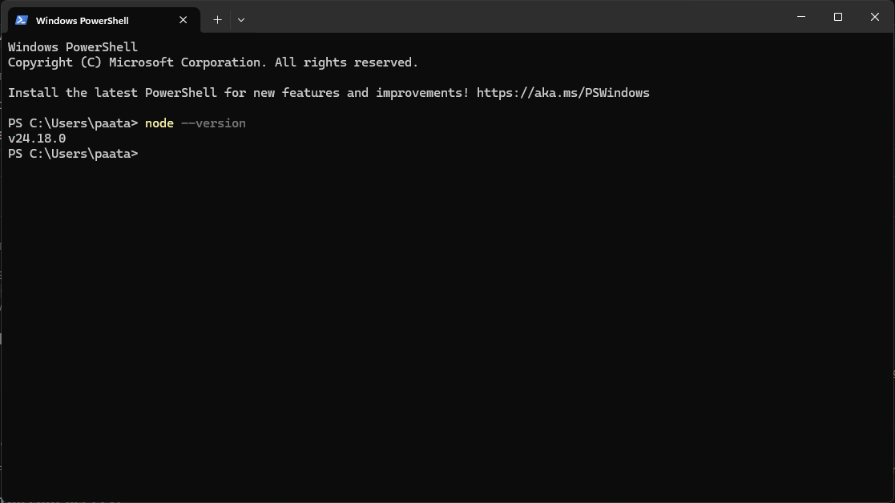
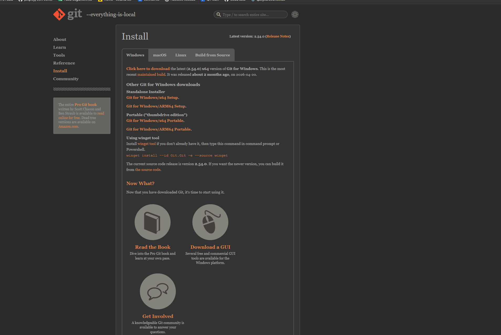
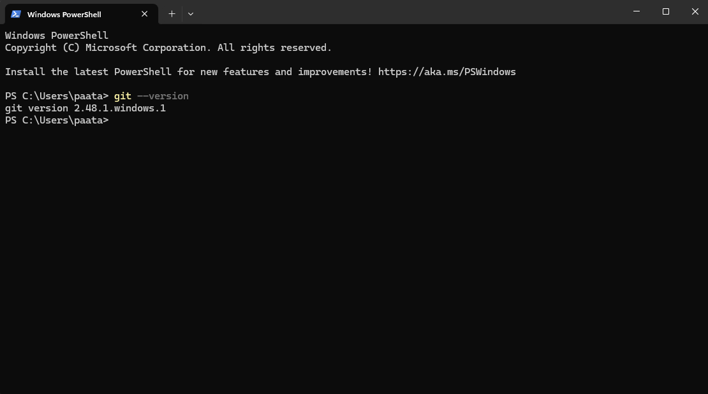
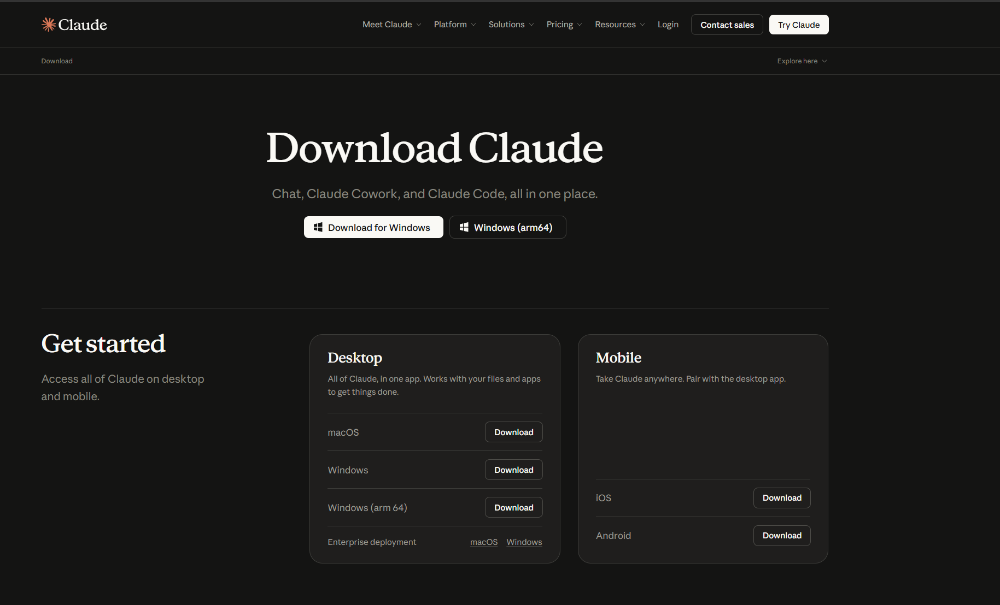
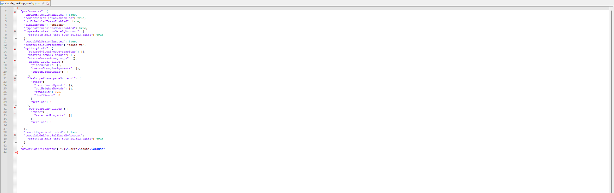
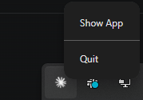
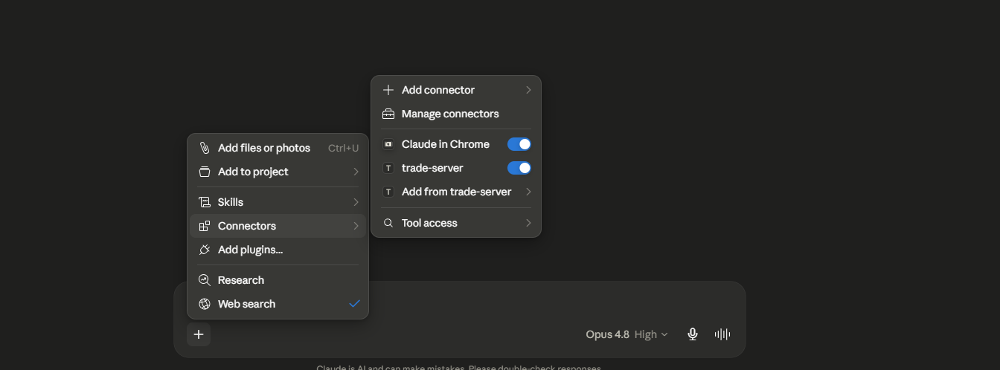

# Claude Desktop Setup — Step by Step (No Experience Needed)

This guide takes you from a brand-new computer to **talking to your trading account through
Claude** — checking balances, pulling quotes, placing and managing orders, all in plain English.
No coding, and **no prior experience with "MCP" required.**

> **What's an MCP?** It's just a small helper that lets Claude talk to another system — here, your
> YourBourse Trade Server. You install it once; after that you simply chat with Claude.

## What you'll need

- About **15 minutes**.
- Three details **from your broker** (just ask them):
  1. Your **server address** (a web link, e.g. `https://your-server.example.com`).
  2. Your **account login**.
  3. Your **password**.
- A Windows or macOS computer. (These steps show **Windows** with screenshots; macOS is the same
  flow — macOS screenshots are coming soon.)

You'll work through a few short steps: install **Node.js**, install **git**, install **Claude
Desktop**, open the config file, paste a small configuration, restart, and check it works. Let's go.

---

## Step 1 — Install Node.js

Node.js is the engine that runs the helper. It's free.

1. Go to **[nodejs.org](https://nodejs.org)**.
2. Click the big **"LTS"** download button (LTS = the stable version).

   

3. Open the downloaded file and click **Next → Next → Install** (the defaults are fine).

   

4. **Check it worked.** Open **PowerShell** (press the Windows key, type `PowerShell`, press Enter)
   and type:

   ```powershell
   node --version
   ```

   You should see a version number like `v20.x.x`.

   

> **macOS:** download the macOS "LTS" installer from [nodejs.org](https://nodejs.org), run it, then
> check with `node --version` in the Terminal app. _(Screenshots pending.)_

---

## Step 2 — Install git

`git` is what lets the helper download itself from the internet the first time. Also free.

1. Go to **[git-scm.com/download/win](https://git-scm.com/download/win)** and let the download start.

   

2. Open the installer and click through with the **default options** (just keep clicking Next, then
   Install).
3. **Check it worked.** In PowerShell, type:

   ```powershell
   git --version
   ```

   You should see a version number like `git version 2.x.x`.

   

> **macOS:** git is usually already installed. Type `git --version` in Terminal; if macOS prompts
> you to install developer tools, accept. Otherwise get it from
> [git-scm.com](https://git-scm.com/download/mac). _(Screenshots pending.)_

---

## Step 3 — Install Claude Desktop

1. Go to **[claude.ai/download](https://claude.ai/download)** and download Claude Desktop for your
   system.

   

2. Install it and sign in with your Claude account.

---

## Step 4 — Open the configuration file

This is the one step people get stuck on, so we'll make it easy. The most reliable way opens the
exact file for you — you never have to go hunting.

1. In Claude Desktop, open **Settings** (the gear icon, or press `Ctrl + ,`).
2. Click **Developer** in the left sidebar.
3. Click the **Edit Config** button. This opens the file `claude_desktop_config.json` in your text
   editor (usually Notepad).

   

> **If you'd rather find the file yourself**, its location depends on how you installed Claude:
> - **Standard installer:** `%APPDATA%\Claude\claude_desktop_config.json`
> - **Microsoft Store version:** `%LOCALAPPDATA%\Packages\Claude_*\LocalCache\Roaming\Claude\claude_desktop_config.json`
> - **macOS:** `~/Library/Application Support/Claude/claude_desktop_config.json`
>
> The two Windows locations are different — this trips people up. **Just use the "Edit Config"
> button** and you don't have to worry about which one you're on.

The file may be **empty (`{}`)**, or it may already contain a `"preferences"` block. **Either is
fine** — in the next step you'll *add* to it, not replace it.



---

## Step 5 — Paste the configuration

Copy this block:

```json
{
  "mcpServers": {
    "trade-server": {
      "command": "npx",
      "args": ["-y", "github:yourbourse/trade-server-mcp"],
      "env": {
        "YB_BASE_URL": "<your-server-url>",
        "YB_MODE": "client",
        "YB_LOGIN": "<your-login>",
        "YB_PASSWORD": "<your-password>"
      }
    }
  }
}
```

Then fill in the three placeholders with the details from your broker:

| Placeholder | What to put | Notes |
|---|---|---|
| `<your-server-url>` | Your server's full web address | Paste it **exactly as your broker gave it**, including the `https://` (it may or may not include a port — e.g. `https://your-server.example.com` *or* `https://your-server.example.com:32236`). |
| `<your-login>` | Your account login | Keep the quotes, e.g. `"12345"`. |
| `<your-password>` | Your password | Keep the quotes. |

Leave `"YB_MODE": "client"` exactly as it is — that's what makes this *your* trading account.


> **Already have a `"preferences"` block in the file?** Just add the `"mcpServers"` block next to it.
> Put a comma between the two blocks, like this:
>
> ```json
> {
>   "mcpServers": { ... the block above ... },
>   "preferences": { ... whatever was already there ... }
> }
> ```

> **JSON is picky.** Every `{` needs a matching `}`, text values need `"double quotes"`, and items
> in a list are separated by commas — with **no** trailing comma after the last one. If Claude later
> says the config is invalid, it's almost always a missing comma or quote.

**Save the file** (`Ctrl + S`).

---

## Step 6 — Save and fully restart Claude Desktop

Claude only reads the config when it starts, so you need a **full** restart — not just closing the
window.

1. Find the **Claude icon in the system tray** (bottom-right of your screen; click the small **`^`**
   arrow if it's hidden).
2. **Right-click it → Quit.**

   

3. Open Claude Desktop again. **The first launch takes 30–60 seconds** while the helper downloads
   and builds itself — that's normal, and only happens once.

> **macOS:** quit fully with **Claude menu → Quit** (or `Cmd + Q`), then reopen. _(Screenshot pending.)_

---

## Step 7 — Check that it works

> **Important:** your trade-server won't appear in the **list of built-in connectors** (Airtable,
> Slack, and the like) under the `+` menu → **Connectors** — that list is only for Claude's hosted
> connectors. Your local server's tools live under `+` → **Connectors → Tool access** (shown below).

You have two easy ways to confirm it's working:

1. **It's loaded:** open **Settings → Developer** and you should see **trade-server** listed as
   **running**.
2. **It actually works (the real test):** start a normal chat and type:

   > *"Run a health check on the trade server."*

   Claude will use the tool and reply that the server is up, with the current server time and
   version.

   

If you want to see the list of available tools, it's under the `+` menu → **Connectors** →
**Tool access** (where you can also turn the server on/off for a chat).



That's it — you're connected. Try *"What's my account state?"* next.

---

## If something went wrong

| Symptom | Likely cause & fix |
|---|---|
| **Settings → Developer shows trade-server "running", but Claude says it has no tools** | The tools aren't enabled for the chat yet. Go to `+` → **Connectors** → **Tool access** and switch **trade-server** on, then ask again. |
| **Claude says sign-in failed / can't connect** | Double-check your server address — use the **client/public** URL from your broker (not an admin URL), exactly as given. Confirm your login and password too. |
| **The server won't start / "config is invalid"** | A JSON typo — usually a missing comma between blocks, a missing `"quote"`, or a stray trailing comma. Re-open the file and check carefully. |
| **`node is not recognized` / `git is not recognized`** | Node.js or git isn't installed, or you need to **close and reopen PowerShell** after installing so it picks them up. Re-do Step 1 / Step 2. |
| **First launch seems stuck** | The very first start downloads and builds the helper (30–60s). Give it a minute, then check Settings → Developer. |

More help: see [Troubleshooting](./TROUBLESHOOTING.md).

---

## What's next

- Ask Claude things like *"What's my account state?"*, *"Show me a EURUSD quote"*, or
  *"What are my open positions?"*
- [Usage Examples](./USAGE_EXAMPLES.md) — realistic conversations and what they do.
- [Client Mode](./CLIENT_MODE.md) — everything a trader can do, and what's deliberately off-limits.

> **Running the server as a broker, not a trader?** You'll use admin credentials instead — see
> [Admin Mode](./ADMIN_MODE.md).
