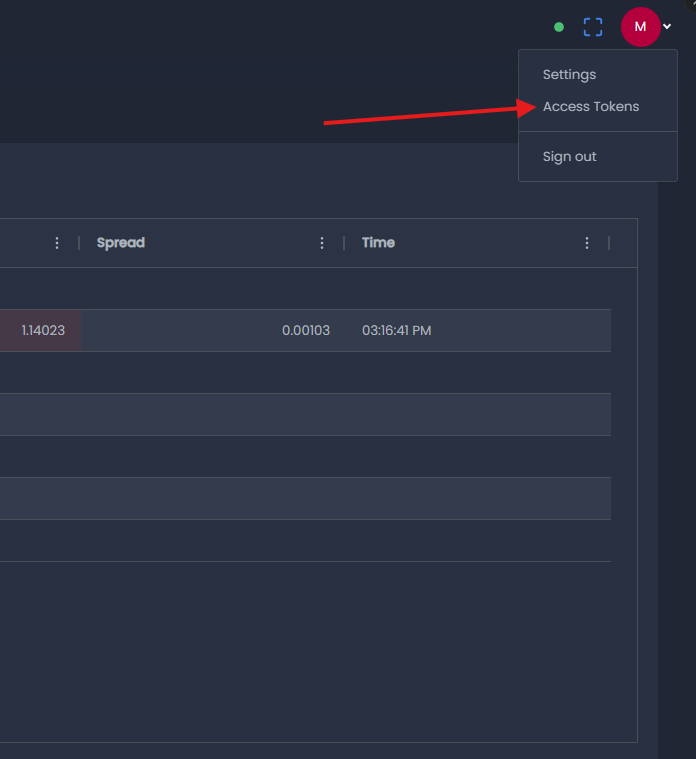
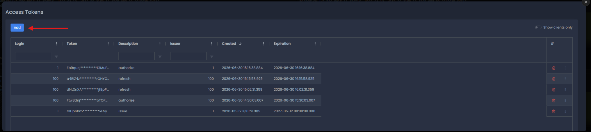
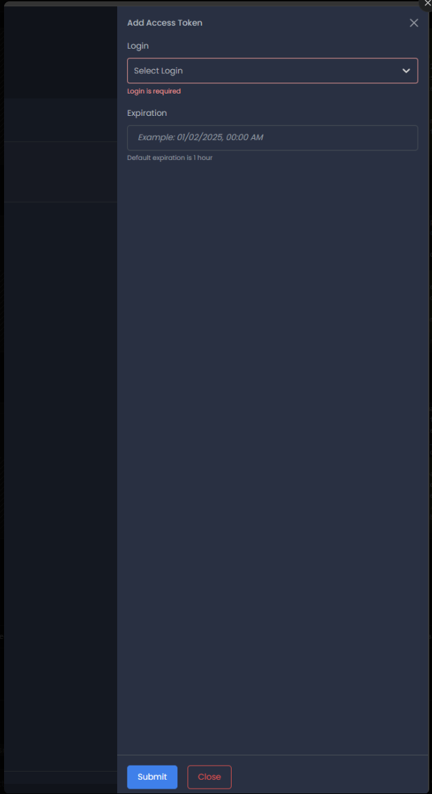
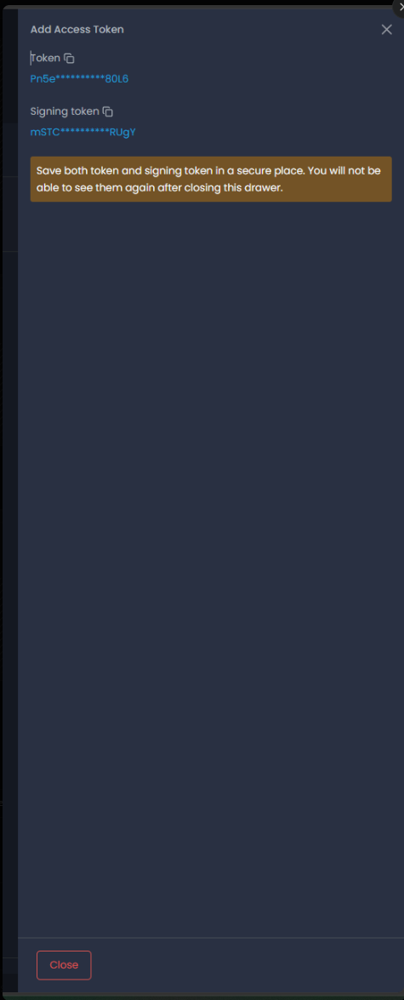

# Configuration

This guide covers every environment variable the Trade Server MCP understands, how the server
decides which mode to run in, and ready-to-paste configuration examples for Claude Desktop,
Claude Code, and any other MCP-compatible client.

If this is your first time setting up the server, start with [Getting Started](./GETTING_STARTED.md).

## Environment variable reference

All configuration is passed through environment variables. Values are trimmed of leading and
trailing whitespace, and a variable set to an empty (or whitespace-only) string is treated as
unset.

| Variable | Applies to | Required | Description |
|---|---|---|---|
| `YB_BASE_URL` | All modes | Yes | Base URL of your YourBourse Trade Server, including the scheme and port, with no trailing slash — for example `https://<your-server-host>:<port>`. The MCP appends `/api/v1/...` to this URL for every request. **The port depends on the mode**: the client (public) API and the admin API are served on different ports of the same Trade Server — use the client port for client mode and the admin port for admin mode; your broker or server operator tells you which is which. |
| `YB_MODE` | All modes | Recommended | `admin` or `client`. Optional when the mode can be inferred from your credential variables (see below), but always safe to set explicitly. |
| `YB_API_KEY` | Admin mode, or client mode with a token pair | Yes, in those setups | The API key (public half of the key pair) issued for your account. |
| `YB_SECRET_KEY` | Admin mode, or client mode with a token pair | Yes, in those setups | The secret key (signing half of the key pair). It is used only to sign requests locally and is never transmitted. |
| `YB_LOGIN` | Client mode with login/password | Yes, in that setup | Your trading account number. Must be a positive integer. |
| `YB_PASSWORD` | Client mode with login/password | Yes, in that setup | Your trading account password. It is used only as the local signing secret for the sign-in request — it is never sent over the network, logged, or echoed. |
| `YB_BROKER` | Client mode with login/password | No | Your broker's company name, sent along with the sign-in request. Only needed if your broker tells you to set it (for example, when one server hosts more than one broker). |
| `YB_REQUEST_TIMEOUT_MS` | All modes | No | Per-request timeout for all REST calls, in milliseconds. Positive integer. Default `10000` (10s). On expiry the call fails with a stable `TIMEOUT` error; timeouts are never auto-retried (so an in-flight order placement is not re-sent). |

## Mode selection and inference

There are three working setups:

1. **Admin mode** — for broker administrators. Uses a static admin key pair
   (`YB_API_KEY` + `YB_SECRET_KEY`). Server-wide access.
2. **Client mode, login/password** — for traders. Signs in with `YB_LOGIN` + `YB_PASSWORD`
   (plus `YB_BROKER` if your broker requires it) and manages its session token automatically.
3. **Client mode, token pair** — for traders who have been issued a public API token pair by
   their broker. Uses `YB_API_KEY` + `YB_SECRET_KEY` with `YB_MODE=client`.

The mode is decided in this order of precedence:

1. If `YB_MODE` is set, it wins. Valid values are `admin` and `client`.
2. Otherwise, if `YB_LOGIN` or `YB_PASSWORD` is set, the mode is inferred as **client**.
3. Otherwise, if `YB_API_KEY` or `YB_SECRET_KEY` is set, the mode is inferred as **admin**.
4. Otherwise, startup fails with a configuration error.

Two notes worth remembering:

- **If you mix credential variables, set `YB_MODE` explicitly.** A token pair
  (`YB_API_KEY`/`YB_SECRET_KEY`) without `YB_MODE` is taken to mean admin mode — so client
  token setups must include `YB_MODE=client`.
- In client mode you must pick **one** credential style. Setting both `YB_LOGIN`/`YB_PASSWORD`
  and `YB_API_KEY`/`YB_SECRET_KEY` is rejected at startup.

## Configuration examples

The examples below use placeholders — replace `<your-server-host>:<port>`, `<api-key>`,
`<secret-key>`, `<login>`, `<password>`, and `<broker-company-name>` with your own values.

Requirements: **Node.js 18+** and **git**. On the first launch, npx fetches and builds the latest
code from the `main` branch then caches it — subsequent starts are instant. Because npx caches by
spec, it may keep running the cached copy until you clear the npx cache, which forces a refetch of the newest `main`.
Prefer a fixed, reproducible version? See [Pinning a version](#pinning-a-version) below.

### Which install method?

**npx from GitHub (recommended).** The configs below use `npx -y github:yourbourse/trade-server-mcp`:
your MCP client fetches, builds, and runs the server straight from this repository — no manual
clone, no separate build step, and you automatically pick up fixes as they land on `main`. This is
the right choice for almost everyone. It needs Node.js 18+ and read access to the repository.

**Clone and build (local checkout).** Choose this only if you specifically need to:

- run **offline or air-gapped**, where fetching from GitHub at launch isn't possible;
- **audit or modify** the code before it runs;
- pin to an **exact local build** you control and rebuild on your own schedule; or
- avoid any network fetch at startup.

The trade-off is that you manage updates yourself (`git pull` + `npm run build`). For a controlled,
reproducible deployment without a full clone, pinning a tag or commit is usually enough — see
[Pinning a version](#pinning-a-version). The [Security](./SECURITY.md) guide explains why the
project is distributed from GitHub rather than the npm registry.

### Setup 1: Admin mode (broker administrators)

**Claude Desktop** — add to `claude_desktop_config.json`:

```json
{
  "mcpServers": {
    "trade-server": {
      "command": "npx",
      "args": ["-y", "github:yourbourse/trade-server-mcp"],
      "env": {
        "YB_BASE_URL": "https://<your-server-host>:<port>",
        "YB_MODE": "admin",
        "YB_API_KEY": "<api-key>",
        "YB_SECRET_KEY": "<secret-key>"
      }
    }
  }
}
```

**Claude Code** — one-liner:

```bash
claude mcp add trade-server \
  --env YB_BASE_URL=https://<your-server-host>:<port> \
  --env YB_MODE=admin \
  --env YB_API_KEY=<api-key> \
  --env YB_SECRET_KEY=<secret-key> \
  -- npx -y github:yourbourse/trade-server-mcp
```

**Claude Code** — or declare it in your project's `.mcp.json`:

```json
{
  "mcpServers": {
    "trade-server": {
      "command": "npx",
      "args": ["-y", "github:yourbourse/trade-server-mcp"],
      "env": {
        "YB_BASE_URL": "https://<your-server-host>:<port>",
        "YB_MODE": "admin",
        "YB_API_KEY": "<api-key>",
        "YB_SECRET_KEY": "<secret-key>"
      }
    }
  }
}
```

### Setup 2: Client mode, login/password (traders)

**Claude Desktop** — add to `claude_desktop_config.json`:

```json
{
  "mcpServers": {
    "trade-server": {
      "command": "npx",
      "args": ["-y", "github:yourbourse/trade-server-mcp"],
      "env": {
        "YB_BASE_URL": "https://<your-server-host>:<port>",
        "YB_MODE": "client",
        "YB_LOGIN": "<login>",
        "YB_PASSWORD": "<password>"
      }
    }
  }
}
```

If your broker told you to set a broker name, add `"YB_BROKER": "<broker-company-name>"`
to the `env` block.

**Claude Code** — one-liner:

```bash
claude mcp add trade-server \
  --env YB_BASE_URL=https://<your-server-host>:<port> \
  --env YB_MODE=client \
  --env YB_LOGIN=<login> \
  --env YB_PASSWORD=<password> \
  -- npx -y github:yourbourse/trade-server-mcp
```

**Claude Code** — or declare it in your project's `.mcp.json`:

```json
{
  "mcpServers": {
    "trade-server": {
      "command": "npx",
      "args": ["-y", "github:yourbourse/trade-server-mcp"],
      "env": {
        "YB_BASE_URL": "https://<your-server-host>:<port>",
        "YB_MODE": "client",
        "YB_LOGIN": "<login>",
        "YB_PASSWORD": "<password>"
      }
    }
  }
}
```

### Setup 3: Client mode, token pair (traders with an issued API token)

`YB_MODE=client` is **required** here — without it, a key pair is interpreted as admin mode.

**Claude Desktop** — add to `claude_desktop_config.json`:

```json
{
  "mcpServers": {
    "trade-server": {
      "command": "npx",
      "args": ["-y", "github:yourbourse/trade-server-mcp"],
      "env": {
        "YB_BASE_URL": "https://<your-server-host>:<port>",
        "YB_MODE": "client",
        "YB_API_KEY": "<api-key>",
        "YB_SECRET_KEY": "<secret-key>"
      }
    }
  }
}
```

**Claude Code** — one-liner:

```bash
claude mcp add trade-server \
  --env YB_BASE_URL=https://<your-server-host>:<port> \
  --env YB_MODE=client \
  --env YB_API_KEY=<api-key> \
  --env YB_SECRET_KEY=<secret-key> \
  -- npx -y github:yourbourse/trade-server-mcp
```

**Claude Code** — or declare it in your project's `.mcp.json`:

```json
{
  "mcpServers": {
    "trade-server": {
      "command": "npx",
      "args": ["-y", "github:yourbourse/trade-server-mcp"],
      "env": {
        "YB_BASE_URL": "https://<your-server-host>:<port>",
        "YB_MODE": "client",
        "YB_API_KEY": "<api-key>",
        "YB_SECRET_KEY": "<secret-key>"
      }
    }
  }
}
```

> **Running from a local clone:** if you cloned and built the repo (see
> [Getting Started](./GETTING_STARTED.md)), replace the `command`/`args` pair above with
> `"command": "node", "args": ["<path-to-repo>/dist/index.js"]`. The `env` block stays
> exactly the same. Example for Claude Desktop:
>
> ```json
> {
>   "mcpServers": {
>     "trade-server": {
>       "command": "node",
>       "args": ["<path-to-repo>/dist/index.js"],
>       "env": {
>         "YB_BASE_URL": "https://<your-server-host>:<port>",
>         "YB_MODE": "client",
>         "YB_LOGIN": "<login>",
>         "YB_PASSWORD": "<password>"
>       }
>     }
>   }
> }
> ```
>
> On Windows, write the path with doubled backslashes, e.g.
> `"C:\\Users\\you\\trade-server-mcp\\dist\\index.js"`.

### Getting an API token pair

This applies to **Setup 3 (client mode, token pair)** only. Most traders don't need it — for a
standing connection, **login/password (Setup 2) is simpler and more robust**: it signs in with the
account you already have and refreshes its session automatically, with no token to manage. Use a
token pair only if your broker issues API tokens, or you'd rather not put your account password in
the configuration.

**Where the pair comes from.** Your broker can issue it for you. If your YourBourse portal exposes
an **Access Tokens** page (a permissioned feature — you may need manager access), you can create one
yourself:

1. Open the **user menu** (your avatar, top-right) and choose **Access Tokens**.

   

2. On the Access Tokens page, click **Add**.

   

3. Choose the **Login** (the trading account the token is for) and set an **Expiration** (read the
   caveat below first), then click **Submit**.

   

4. The drawer now shows a **Token** and a **Signing token**, each with a copy button. **Copy both
   now** — the warning is accurate: you will not be able to see them again after closing the
   drawer. If you lose them, delete the token and issue a new one.

   

Put them in your configuration exactly as in **Setup 3** above:

- **Token** → `YB_API_KEY`
- **Signing token** → `YB_SECRET_KEY`
- plus `YB_MODE=client`

> **⚠️ Choose the expiration deliberately.** Access tokens **expire** — the default is **1 hour**.
> In token-pair mode the MCP uses the pair exactly as issued and **does not refresh it**, so when the
> token expires every call fails (HTTP 401) until you issue a new pair and update your configuration.
> The 1-hour default is fine for a quick test; for a standing connection set a long expiration, or
> use **login/password (Setup 2)**, which refreshes automatically and never expires out from under
> you.

### Running more than one server

You can connect to more than one Trade Server at the same time — for example two separate
broker servers, a production and a test server, or an admin connection to one server plus a
trader connection to another. The MCP runs as one process per connection, so you simply
**register it once per server**, each registration under its own name with its own settings.

- Give each entry a **distinct name** (for example, one per broker) so you and the AI can tell
  them apart.
- Each entry carries its **own `env` block** — its own `YB_BASE_URL`, mode, and credentials.
- The entries run as independent processes, so the AI sees every server's tools **side by
  side**. When you ask for something, name the server you mean ("on broker A, …").

**Claude Desktop** — two trader connections to two different servers, in
`claude_desktop_config.json`:

```json
{
  "mcpServers": {
    "trade-broker-a": {
      "command": "npx",
      "args": ["-y", "github:yourbourse/trade-server-mcp"],
      "env": {
        "YB_BASE_URL": "https://<broker-a-host>:<port>",
        "YB_MODE": "client",
        "YB_LOGIN": "<broker-a-login>",
        "YB_PASSWORD": "<broker-a-password>"
      }
    },
    "trade-broker-b": {
      "command": "npx",
      "args": ["-y", "github:yourbourse/trade-server-mcp"],
      "env": {
        "YB_BASE_URL": "https://<broker-b-host>:<port>",
        "YB_MODE": "client",
        "YB_LOGIN": "<broker-b-login>",
        "YB_PASSWORD": "<broker-b-password>"
      }
    }
  }
}
```

Any combination works — admin on one server and client on another, production and test, and so
on. Each connection is just another named entry with the credentials for that server (any of
the three setups above).

**Other hosts:** in VS Code the same idea applies under the `servers` key (see
[VS Code setup](./VSCODE_SETUP.md)) — add a second named entry. The one exception is the
**`.mcpb` Claude Desktop extension**, which installs as a single trader (client) connection with
one set of details; to run more than one server, or any admin connection, use the JSON
configuration shown above.

> **One server per entry.** Each registration is fixed to its configured server and mode when it
> starts — there is no switching between servers within a single entry. To reach another server,
> add another entry.

### Other MCP clients

Any MCP-compatible client that supports stdio servers can run the Trade Server MCP. Configure it
to launch `npx -y github:yourbourse/trade-server-mcp` over the **stdio** transport, with
the environment variables from whichever setup above matches your situation. There is no HTTP/SSE
endpoint — the server communicates exclusively over stdin/stdout, and writes its log lines to
stderr.

### Pinning a version

By default the install follows the **`main` branch** — `github:yourbourse/trade-server-mcp` — i.e. the
latest code, a mutable target. If you need a **reproducible, immutable build** (for example a
controlled deployment where you decide exactly when to upgrade), pin a specific release **tag**
instead:

```json
"args": ["-y", "github:yourbourse/trade-server-mcp#v2.0.0"]
```

A tag is stable in practice, but tags can technically be re-pointed; for a guarantee that the code can
never change, pin a **commit SHA** instead (`github:yourbourse/trade-server-mcp#<commit-sha>`). See
[Security](./SECURITY.md) for the supply-chain rationale behind distributing from GitHub rather than
the npm registry.

## Startup error messages

If the configuration is invalid, the server exits at startup with one of the messages below.
Every message is followed by this help text:

```
Trade Server MCP configuration:
  Admin mode  (brokers): YB_BASE_URL + YB_API_KEY + YB_SECRET_KEY [+ YB_MODE=admin] (set YB_MODE explicitly if mixing credential variables)
  Client mode (traders): YB_BASE_URL + YB_LOGIN + YB_PASSWORD [+ YB_BROKER] + YB_MODE=client
  Client mode (token):   YB_BASE_URL + YB_API_KEY + YB_SECRET_KEY + YB_MODE=client
```

| Error message | What to do |
|---|---|
| `Missing YB_BASE_URL.` | Set `YB_BASE_URL` to your Trade Server's URL, e.g. `https://<your-server-host>:<port>`. Remember that an empty or whitespace-only value counts as unset. |
| `Admin mode requires YB_API_KEY.` | You are in admin mode (explicitly, or inferred from `YB_SECRET_KEY`) but `YB_API_KEY` is missing. Add it, or switch to a client setup. |
| `Admin mode requires YB_SECRET_KEY.` | Same as above, but the secret half of the pair is missing. Add `YB_SECRET_KEY`. |
| `Client mode: set either YB_LOGIN/YB_PASSWORD or YB_API_KEY/YB_SECRET_KEY, not both.` | You provided both credential styles in client mode. Remove the pair you do not intend to use. |
| `Client login mode requires YB_LOGIN.` | You set `YB_PASSWORD` but not `YB_LOGIN`. Add your account number. |
| `YB_LOGIN must be a positive integer (got "<value>").` | `YB_LOGIN` must be your numeric account number — digits only, no spaces or letters. |
| `Client login mode requires YB_PASSWORD.` | You set `YB_LOGIN` but not `YB_PASSWORD`. Add your account password. |
| `Client token mode requires both YB_API_KEY and YB_SECRET_KEY.` | In client token mode, both halves of the token pair are required. Add the missing one. |
| `Client mode requires credentials.` | `YB_MODE=client` is set but no credentials were found. Add either `YB_LOGIN` + `YB_PASSWORD` or `YB_API_KEY` + `YB_SECRET_KEY`. |
| `Unknown YB_MODE "<value>". Valid values: admin, client.` | `YB_MODE` must be exactly `admin` or `client` (lowercase). Fix the value. |
| `No mode could be inferred — set either YB_API_KEY + YB_SECRET_KEY (admin) or YB_LOGIN + YB_PASSWORD (client).` | `YB_BASE_URL` is set but no credential variables are. Add credentials for the mode you want. |

When startup fails this way, the process prints `Fatal error:` followed by the message above to
stderr and exits with code 1. Where to find your MCP client's stderr log is covered in
[Troubleshooting](./TROUBLESHOOTING.md).

## Startup log lines

On a healthy start, the server writes one mode line to stderr, then a final ready line. These
are the exact strings to look for:

**Admin mode:**

```
Trade Server MCP: admin mode (server-wide tools)
```

**Client mode, login/password, sign-in succeeded** (the account number is your `YB_LOGIN`):

```
Trade Server MCP: client mode, signed in as account <login>
```

**Client mode, login/password, sign-in failed** — the server still starts, registers all tools,
and retries sign-in on each tool call. `<hint>` is a targeted diagnosis of the failure
(wrong credentials, server version, or connectivity — see
[Troubleshooting](./TROUBLESHOOTING.md)):

```
Trade Server MCP: client mode — sign-in FAILED. <hint> Tools are registered; calls will retry sign-in.
```

**Client mode, token pair:**

```
Trade Server MCP: client mode (public API token)
```

**Always, once the server is ready:**

```
Trade Server MCP running on stdio
```

## Where next

- [Getting Started](./GETTING_STARTED.md) — install and first connection
- [Tools Reference](./TOOLS_REFERENCE.md) — every tool in both modes
- [Authentication](./AUTHENTICATION.md) — how request signing and token refresh work
- [Security](./SECURITY.md) — credential-handling guarantees and recommendations
- [Troubleshooting](./TROUBLESHOOTING.md) — symptom-first fixes
